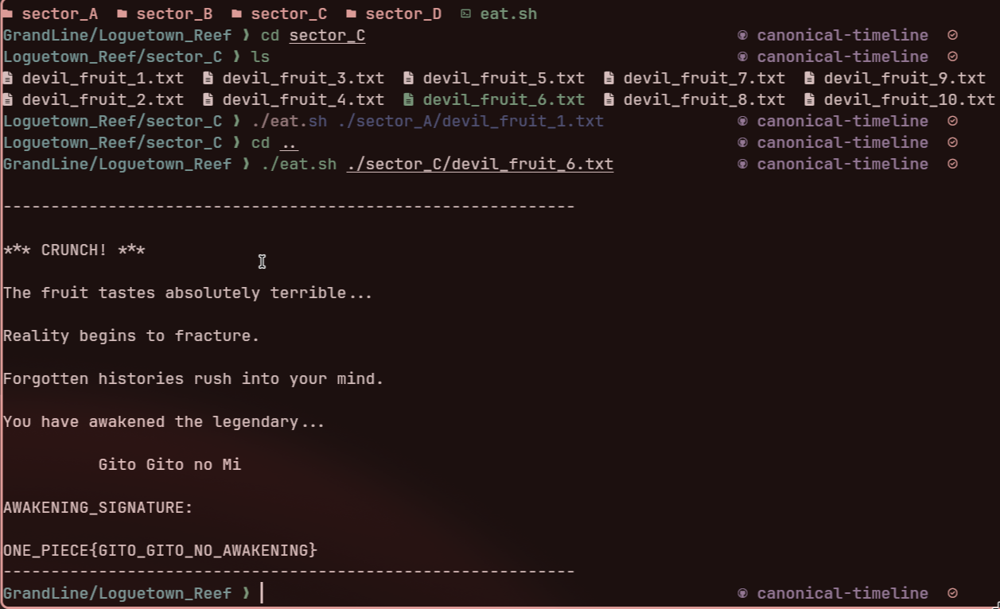
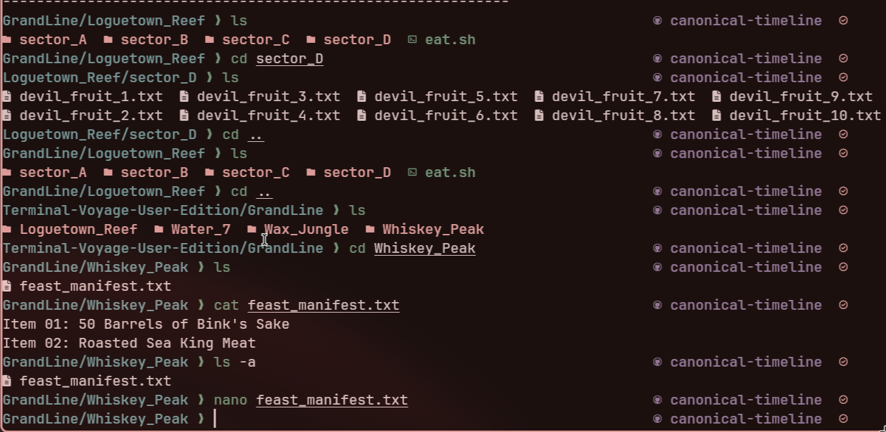
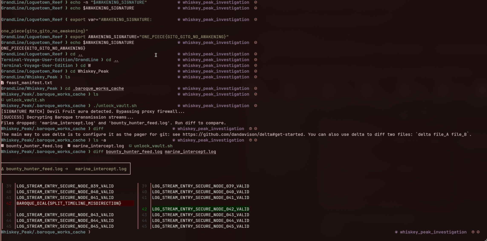
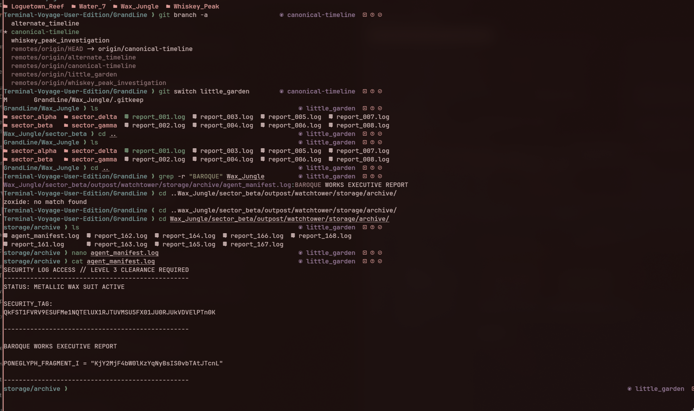
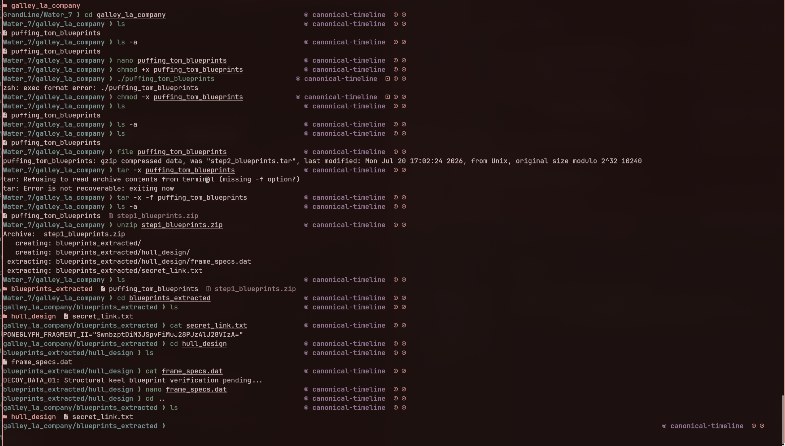
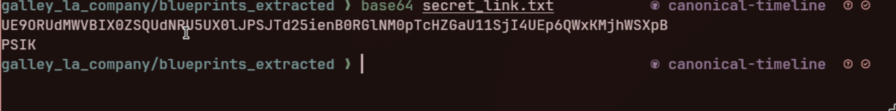
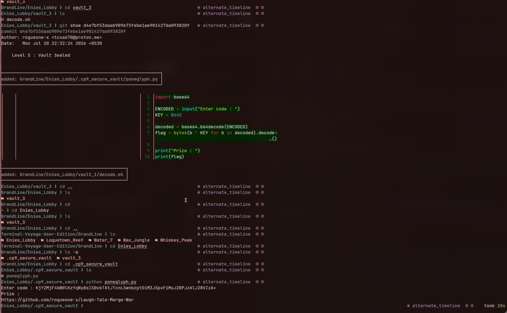
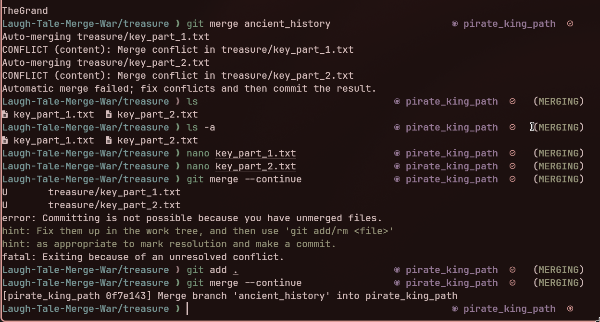

### Level 1

ONE_PIECE{GITO_GITO_NO_AWAKENING}
### Level 2


switched branch to whiskey_peak_investigation

I used ```export variable="ONE_PIECE{GITO_GITO_NO_AWAKENING}" :: to set variable ```


BAROQUE_DIAL{SPLIT_TIMELINE_MISDIRECTION}

### Level 3

switched to little_garden branch



used ```grep -r "BAROQUE" Wax_Jungle :: to iterate through all files in Wax_Jungle and find the same pattern```


```

```SECURITY LOG ACCESS // LEVEL 3 CLEARANCE REQUIRED
-------------------------------------------------
STATUS: METALLIC WAX SUIT ACTIVE

SECURITY_TAG:
QkFST1FVRV9ESUFMe1NQTElUX1RJTUVMSU5FX01JU0RJUkVDVElPTn0K

-------------------------------------------------

BAROQUE WORKS EXECUTIVE REPORT

PONEGLYPH_FRAGMENT_I = "KjY2MjF4bW0lKzYqNyBsIS0vbTAtJTcnL"


-------------------------------------------------
```
inside found this 

PONEGLYPH_FRAGMENT_I = "KjY2MjF4bW0lKzYqNyBsIS0vbTAtJTcnL"

### Level 4

switched back to branch canonical-timeline
and used ```file puffing_tom_blueprints :: to check the filetype```
then used ``` tar -x -f puffing_tom_blueprints :: to extract the contents
		    unzip step1_blueprints.zip :: to unzip it```



PONEGLYPH_FRAGMENT_II="SwnbzptDiM3JSpvFiMuJ28PJzAlJ28VIzA="


dont know what this is for though


### Level 5

switched to alternate_timeline since, while looking through git logs I understood that it was not in canonical
git logs:: 
```Current branch alternate_timeline is up to date.
Terminal-Voyage-User-Edition/GrandLine ❯ git log                           alternate_timeline       
commit c337460b6dc0bf204288b641d69cb0a19f898266 (HEAD -> alternate_timeline, origin/alternate_timeline)
Author: rogueone-x <tcxa670@proton.me>
Date:   Mon Jul 20 22:32:24 2026 +0530

    Vaults REMOVED, Evidences ERASED

commit 23b4e679b21c15adec2307e802573489a2580665
Author: rogueone-x <tcxa670@proton.me>
Date:   Mon Jul 20 22:32:24 2026 +0530

    Vaults REMOVED, Evidences ERASED

commit d4e7bf53daab989e73febe1ae901427da093820f
Author: rogueone-x <tcxa670@proton.me>
Date:   Mon Jul 20 22:32:24 2026 +0530

    Level 5 : Vault Sealed

commit aa616cacc1e0608f1b80627261a34ef02dd08f73
Author: rogueone-x <tcxa670@proton.me>
Date:   Mon Jul 20 22:32:24 2026 +0530

    Level 4: Implemented multi-layered archive obfuscation for Water 7 blueprints

commit a80266248d76a9818a435248b7a44a7cf5c5855a
Author: rogueone-x <tcxa670@proton.me>
Terminal-Voyage-User-Edition/GrandLine ❯  
```

so to view that i used ```git view ``` resulting in this :-:-:-> then combined 2 fragments to 
input code :: KjY2MjF4bW0lKzYqNyBsIS0vbTAtJTcnLSwnbzptDiM3JSpvFiMuJ28PJzAlJ28VIzA=



### Level 6

after cloning into [git@github.com:rogueone-x/Laugh-Tale-Merge-War.git] I tries to merge two branches using ```Laugh-Tale-Merge-War ❯ git merge origin/pirate_king_path                        ancient_history      ```

which returned merge conflicts.


which on correcting showed me this 
```Laugh-Tale-Merge-War/treasure ❯ cat key_part_1.txt                             pirate_king_path      
PONEGLYPH FRAGMENT α

Recovered Inscription:

TheGrandLine

Laugh-Tale-Merge-War/treasure ❯ cat key_part_2.txt                             pirate_king_path      
PONEGLYPH FRAGMENT β

Recovered Inscription:

Remem
bers

Laugh-Tale-Merge-War/treasure ❯    
```

which when given to ```sh victory.sh  ``` showed !!!!!
## ``` Laugh-Tale-Merge-War ❯ sh victory.sh                                           pirate_king_path      

==============================
 Verifying Timeline Integrity 
==============================

Enter the Pirate King's Password: TheGrandLineRemembers
Timeline Integrity ............. OK
Merge Conflict ................. Resolved
Repository ..................... Restored
History ........................ Preserved

====================================================

        THE ONE PIECE HAS BEEN FOUND

====================================================

Congratulations, Captain.

The greatest treasure was never gold.

It was the ability to understand,
recover,
and preserve history.

Today you have mastered:

⚓ Linux
⚓ Git
⚓ Problem Solving

FLAG{The_Grand_Line_Remembers_Your_Commit}

====================================================

🏴 REWARD UNLOCKED

Title:
    Pirate King of Git

Badge:
    👑 Keeper of History

Your bounty has increased to

    5,600,000,000 ฿

The Thousand Sunny will always have a place for you.

Now go write your own history.
Laugh-Tale-Merge-War ❯                                                                                                                                                 pirate_king_path      ```
```
